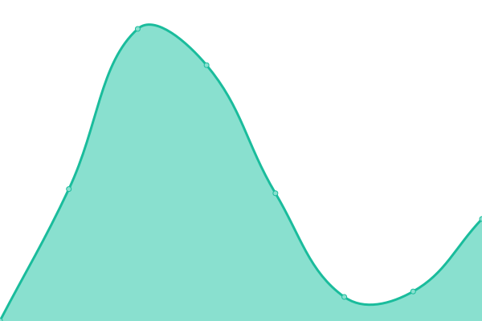
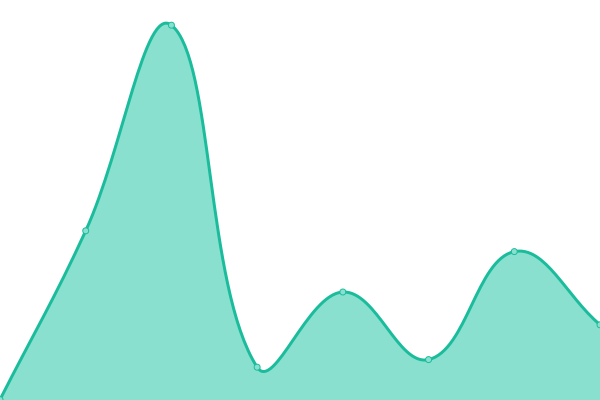
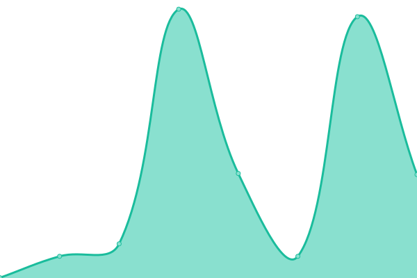
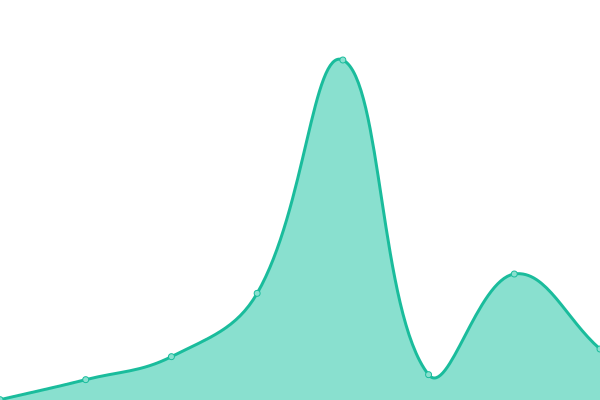
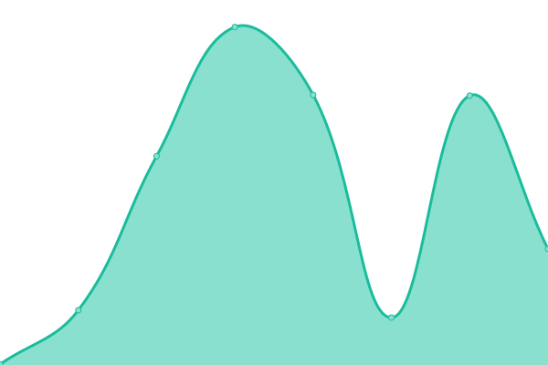
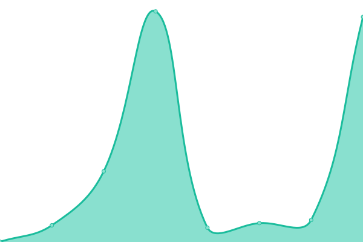

# [📈 Live Status](https://u.hui.ke): <!--live status--> **🟩 All systems operational**

This repository contains the open-source uptime monitor and status page for [Hui.Ke](https://hui.ke/), powered by [Upptime](https://github.com/upptime/upptime).

With [Upptime](https://upptime.js.org), you can get your own unlimited and free uptime monitor and status page, powered entirely by a GitHub repository. We use [Issues](https://github.com/9201314/u/issues) as incident reports, [Actions](https://github.com/9201314/u/actions) as uptime monitors, and [Pages](https://u.hui.ke) for the status page.

<!--start: status pages-->
<!-- This summary is generated by Upptime (https://github.com/upptime/upptime) -->
<!-- Do not edit this manually, your changes will be overwritten -->
<!-- prettier-ignore -->
| URL | Status | History | Response Time | Uptime |
| --- | ------ | ------- | ------------- | ------ |
|  [Hui.Ke](https://hui.ke/) | 🟩 Up | [hui-ke.yml](https://github.com/9201314/u/commits/HEAD/history/hui-ke.yml) | 

 487ms
     
 | 

<a href="https://u.hui.ke/history/hui-ke">100.00%</a>
    

|  [Hui.Ke - Blog](https://b.hui.ke/) | 🟩 Up | [hui-ke-blog.yml](https://github.com/9201314/u/commits/HEAD/history/hui-ke-blog.yml) | 

 612ms
     
 | 

<a href="https://u.hui.ke/history/hui-ke-blog">100.00%</a>
    

|  [Hui.Ke - Forum](https://f.hui.ke/) | 🟩 Up | [hui-ke-forum.yml](https://github.com/9201314/u/commits/HEAD/history/hui-ke-forum.yml) | 

 480ms
     
 | 

<a href="https://u.hui.ke/history/hui-ke-forum">100.00%</a>
    

|  [Hui.Ke - Photos & Pics & Ps](https://p.hui.ke/) | 🟩 Up | [hui-ke-photos-and-pics-and-ps.yml](https://github.com/9201314/u/commits/HEAD/history/hui-ke-photos-and-pics-and-ps.yml) | 

 244ms
     
 | 

<a href="https://u.hui.ke/history/hui-ke-photos-and-pics-and-ps">100.00%</a>
    

|  [Hui.Ke - Search](https://s.hui.ke/) | 🟩 Up | [hui-ke-search.yml](https://github.com/9201314/u/commits/HEAD/history/hui-ke-search.yml) | 

 399ms
     
 | 

<a href="https://u.hui.ke/history/hui-ke-search">100.00%</a>
    

|  [Hui.Ke - Tools](https://t.hui.ke/) | 🟩 Up | [hui-ke-tools.yml](https://github.com/9201314/u/commits/HEAD/history/hui-ke-tools.yml) | 

 180ms
     
 | 

<a href="https://u.hui.ke/history/hui-ke-tools">100.00%</a>
    

|  [Hui.Ke - Uptime](https://u.hui.ke/) | 🟩 Up | [hui-ke-uptime.yml](https://github.com/9201314/u/commits/HEAD/history/hui-ke-uptime.yml) | 

 308ms
     
 | 

<a href="https://u.hui.ke/history/hui-ke-uptime">100.00%</a>
    

<!--end: status pages-->

[**Visit our status website →**](https://u.hui.ke)

## 📄 License

- Powered by: [Upptime](https://github.com/upptime/upptime)
- Code: [MIT](./LICENSE) © [Hui.Ke](https://hui.ke/)
- Data in the `./history` directory: [Open Database License](https://opendatacommons.org/licenses/odbl/1-0/)
